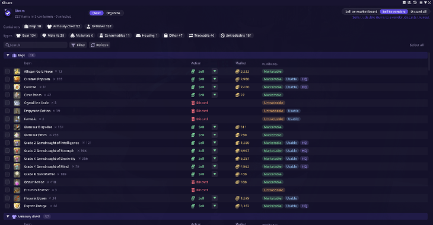
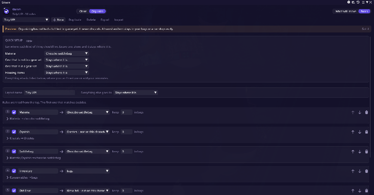
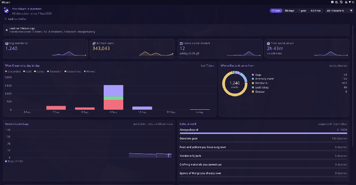
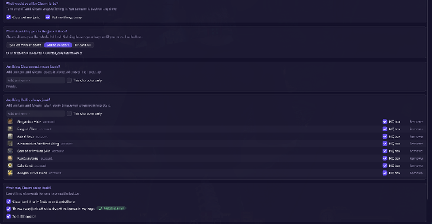

<div align="center">


# Gleam

**Clears out your junk and puts the rest away.**

A Dalamud plugin for Final Fantasy XIV that finds the junk in your bags, armoury chest, saddlebag, retainers and glamour dresser, and clears it out with one button.

[](https://github.com/sleousis/Gleam/releases/latest)
[](https://github.com/sleousis/Gleam/releases)
[](LICENSE)

</div>

<p align="center">
  
  
  
  
</p>

## Key features

- **One list for everything.** Junk from your bags, armoury chest, saddlebag, retainers and glamour dresser shows up in one place, with market prices from [Universalis](https://universalis.app).
- **You choose what happens to it.** Put it up on the market board, sell it to a vendor or discard it. Nothing leaves your bags until you press Clean.
- **It does the walking.** Hands-free trips open the saddlebag, travel to an inn for your retainers and the dresser, and visit a merchant or your Grand Company when a sale or turn-in needs one.
- **Layouts put the rest away.** Send materia to the saddlebag, spare gear to a retainer and gear set pieces to the armoury chest. Organizing never discards or sells anything.
- **Careful by default.** Gear in your gear sets, glamour plate items and anything on your never-touch list are never touched. A big run asks you twice, and Stop ends a run at once.
- **Highlights in your bags.** Items that will be cleaned or moved are tinted in the game's own bag windows.
- **Statistics.** See the bag slots Gleam has freed, the gil it made and where the junk came from.
- **Other client languages.** Gleam is tested on the English client. It reads menus and prompts from the game's own text, so Japanese, German and French clients should work too, but they have not been tried yet. If you play on one, `/gleam selftest` shows whether Gleam finds everything it needs.

## Requirements

Gleam needs these plugins.

- **[vnavmesh](https://github.com/awgil/ffxiv_navmesh)** walks your character to the bell, the dresser and the merchant. Gleam cannot finish a run without it.
- **[Lifestream](https://github.com/NightmareXIV/Lifestream)** teleports you between towns and into an inn. Without it, start a run while you are already in an inn.

These are optional.

- **[AutoRetainer](https://github.com/PunishXIV/AutoRetainer)** lets Gleam throw away the junk a finished venture leaves in your bags.
- **[Allagan Tools](https://github.com/Critical-Impact/InventoryTools)** shows what your retainers hold without visiting them, and adds your other characters to the review.

## Installation

1. Install [XIVLauncher](https://github.com/goatcorp/FFXIVQuickLauncher) and start the game through it with Dalamud enabled.
2. In game, type `/xlsettings` and open the **Experimental** tab.
3. Under **Custom Plugin Repositories**, paste the link below into the empty field, press the **+** button, then **Save and Close**.

   ```
   https://raw.githubusercontent.com/sleousis/Gleam/main/repo.json
   ```

4. Type `/xlplugins`, search for **Gleam** under **All Plugins** and install it.

Please install Gleam this way rather than from a release zip. Dalamud then keeps it up to date for you.

### Coming from TidyUp

Gleam used to be called TidyUp, and Dalamud still sees an old copy as a separate plugin. Remove the old copy, version 0.9, in `/xlplugins`. Your settings, layouts and history come across by themselves.

## Commands

| Command | What it does |
| --- | --- |
| `/gleam` or `/gl` | Opens or closes Gleam |
| `/gleam organize` | Opens the layouts that put things away |
| `/gleam stats` | Shows your statistics |
| `/gleam history` | Lists everything Gleam has cleaned or moved, and how to get it back where possible |
| `/gleam settings` | Opens the settings |
| `/gleam scan` | Looks through your inventory again |
| `/gleam merge` | Merges split stacks |
| `/gleam stop` | Stops whatever Gleam is doing |
| `/gleam selftest` | Checks what Gleam can find in the game without touching anything |
| `/gleam report` | Copies a bug report to your clipboard |
| `/gleam troubleshoot` | Opens the troubleshooting window |

## Before you use it

Gleam moves your character and clicks through the game's menus for you. Square Enix's terms of service do not allow third-party tools, and automation is what they act against most. Use it at your own risk.

After a game patch, Gleam pauses hands-free runs until a version checked on that patch is out. Runs you start by hand keep working, and **Go ahead on this patch** in the settings lifts the pause.

Organizing is newer and has not had a full test in game yet. It never discards anything. At worst an item stays in your bags or a run stops early.

## Support

Something not working? Run `/gleam selftest`, then `/gleam report`, and [open an issue](https://github.com/sleousis/Gleam/issues/new/choose) with the report pasted in. The report holds no character or retainer names.

## Contributing

Contributions are welcome. Please open an issue before writing any code, so we can agree on the change first.

Gleam builds with the .NET 10 SDK against Dalamud API 15. The rules and planning live in `Gleam.Core`, which does not depend on the game, and its tests run with `dotnet test`.

## License

Gleam is released under the [MIT License](LICENSE).
